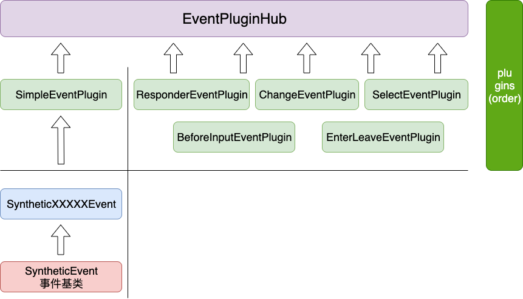
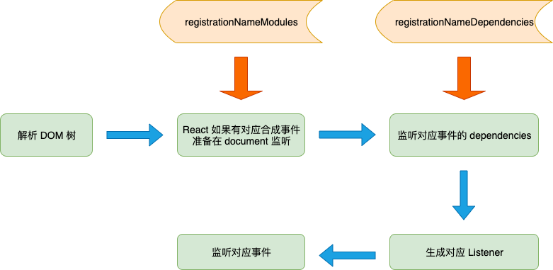
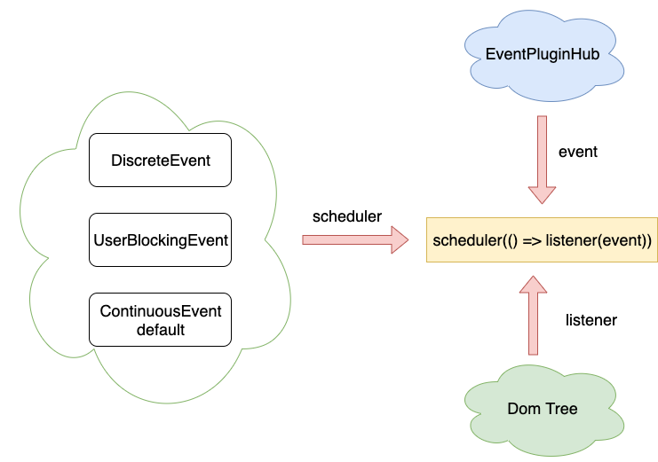

## React 事件机制

### 背景

网看到很多 React 的解析，有 事件机制、Fiber、Hooks，但是很多知识相对零散只集中在一个点，自己对 React 没有一个完成的知识图谱，想自己慢慢去看 React 的源码，一部分一部分的学习 React，最后形成一个自己的 React 知识图谱，这片文章只是一个开始，后面会持续学习

### 长话短说

我们先话短说，React 的事件机制其实使用了 `事件委托` 的方式，React 在内部自己实现了浏览器中对应事件的合成事件，web 浏览器中，浏览器在生成虚拟 dom 树的时候，解析出的合成事件挂载到 document 上 (native 中不是很了解)，部分事件仍然在 dom 元素上，事件的实现是插件的机制，方便后续拓展事件。

> 大多数事件是指 React 内部实现了对应事件的合成事件


### React 事件带来的优势

1. React 合成事件的实现参照 w3c 的标准，抹平了不同浏览器的差异，用户不再需要关注事件的兼容性问题
2. React 将事件都挂在到 document，减少了 dom 节点上的事件信息，能够优化性能
3. React 事件机制其实和 React Virtual dom 的功能相似，React 团队期望 React 能够在多端运行 (比如 React-Native)，而事件的挂在可以在不同运行环境挂在到不同的 节点上，从而实现不同端的运行，只需要在 事件机制中做兼容就好，比如 Responderxxx 文件，就只支持 React-Native 的
4. 事件分发: React 最新的调度算法 Fiber 会对优化交互体验，内部优化浏览器渲染，干预事件分发也可以做更多的优化

### 事件机制的实现

React 事件机制我们主要分三部分来说

1. 插件注册: 插件注册到一起，方便后面使用
2. 事件注册: DOM 的 props 中有事件属性，将事件挂载到 document (统一按照 web 浏览器来，也可能是 Iframe)，注册相应的 listener
3. 事件分发: 在监听的 listener 中，关联到 插件，执行对应事件，根据不同的事件类型，事件执行也有不同的方式

代码的顺序也是按照上面的三步走的，实现的介绍主要用 图 + 文字的方式，尽可能的不看代码，在最后我会把每一部分涉及到的代码统一整理出来，方便自己去看源码


#### 插件注册


从上面的图片中可以看到，目前 React 一共有 6 个事件插件，但是在目前版本的 react 中 changeEventPlugin 是没有在使用的，同时 responderEventPlugin 是在 React-Native 才使用，每一个插件内部都包含很多事件，插件主要是用来组合事件信息、提取事件对象的。

* 左边和右边插件的区别在于，simple 就是简单，一般只是一个事件，而右边都是由多个事件组合成的事件

* SyntheticEvent 是事件的构造函数，SyntheticEvent 对浏览器原生的事件对象做了"包装"，生成一个新的 event 对象，里面有合成事件需要的参数，原生 event 变成 nativeEvent，同时封装了 preventDefault、stopPropagation 等方法，提供了 extend 方法用来继承，采用的寄生组合的方式 (还有点不同)，一些 SyntheticEvent 都是继承自这个构造函数。

	```
  	this.dispatchConfig = dispatchConfig;
  	this._targetInst = targetInst;
 	 this.nativeEvent = nativeEvent;
	```
	
* SyntheticEvent 有一个 pool 的概念，为了避免每一次都使用构造函数创建实例，在一个实例使用过后清空自身属性 (致为 null)，然后需要创建新的实例时，优先获取空实例，添加对应的属性

* 每一个插件主要有两部分能组成，一部分是 eventypes 也就是插件包括的 一些事件和事件依赖的一些事件 (合成事件会依赖多个事件)，另一部分是 extractEvents 获取事件对象，在事件触发时会调用这个方法获取事件对象

	```js
	const plugin = {
  		evenTypes:  {
    			change: {
      				phasedRegistrationNames: {
       		 		bubbled: 'onChange',
        				captured: 'onChangeCapture',
     			 	},
      				dependencies: 
        				TOP_BLUR
     				 ],
    			},
  		},
 		 extractEvents: () => {}
  	}
	```

* 事件最后都会继承到 eventhub 上，本质上就是一个数组，只不过是固定顺序的数组，同时在继承在数组中还生成了一些 map 方便后面使用
   * registrationNameDependencies: eventName -> eventDependencies
   * registrationNameModules: eventName -> plugin

   
#### 事件注册 



这一步主要是针对 dom 树解析，添加事件的流程。Listener 里面包含了事件获取执行等会在后面讲。registrationNameModules、registrationNameDependencies 就是之前插件注册时生成的对象方便我们后面使用。这里主要说两点

* 关于合成事件: 个人理解合成事件，其实多个事件组合成的事件，但是 simpleEvent 本质上并不算是一个合成事件，因为它还是一对一的关系，其他的插件因为有对应的多个 dependencies，所以才是真正的合成事件

* 合成事件的监听: 许多合成事件浏览器没有对应事件，所以我们要"伪装"成有，其实也就是监听事件的 dependencies 中的事件

* 关于事件监听节点:  监听的节点其实主要是 document，但是在不同的运行环境下监听的节点可能不同，可能是 Iframe 也可能是其他节点


#### 事件分发



React 16 以后开始做浏览器的调度工作，其实调度工作不止在 dom diff 上，在事件上也做了部分调度。React 把事件做了分类

* DiscreteEvent: 失焦、聚焦类的事件。调用 dispatchDiscreteEvent
* UserBlockingEvent: 用户连续行操作。比如鼠标移动、拖拽等。调用 scheduler 的 runWithPriority
* ContinuousEvent && default: 连续性事件。 直接执行 

上面三种事件其实最后都是调用了 dispatchEvent 函数，但是因为优先级的原因事件的调度方法不一样，最后的执行事件也不一样

	```
	// 事件优先级
	export const DiscreteEvent: EventPriority = 0;
      export const UserBlockingEvent: EventPriority = 1;
      export const ContinuousEvent: EventPriority = 2;
	```
	
### 代码梳理

React 事件相关的代码主要集中在两部分  react-dom/events/、legacy-events/。

* 事件注册   legacy-events/EventPluginRegistry.js
* 事件分发
  * react-dom/client/ReactDOMComponent: 遍历 dom 节点
  *  react-dom/events/ReactBrowserEventEmitter: 监听依赖事件
  * react-dom/events/ReactDOMEventListener: 生成监听函数
* 插件注册
  * legacy-events/EventPluginRegistry: 插件注册并生成相关对象
* 事件分发
  * react-dom/events/ReactDOMEventListener: 根据事件类型执行不同的调度函数
  * react-dom/events/ ReactDOMEventReplaying： DiscreteEvent 事件的调度
  * Scheduler: UserBlockingEvent 事件的调度
  * legacy-events/ReactGenericBatching: 真正执行事件


### 总结
 
 React 的事件机制大体的流程和上面的内容是一致的，不过内部还有很多的细节需要看代码才能清楚。而且项目里面还有和其他地方耦合的代码所以代码看起来比较凌乱，但是思路是很清晰的。
 
 事件机制其实本质上是很简单的，但是 React 团队为了保证整体的灵活性，其实在设计上做了很多功夫，也是我在开发中需要借鉴的地方。看代码也是这样，其实思路清楚了代码也就容易看很多了。
 
 


