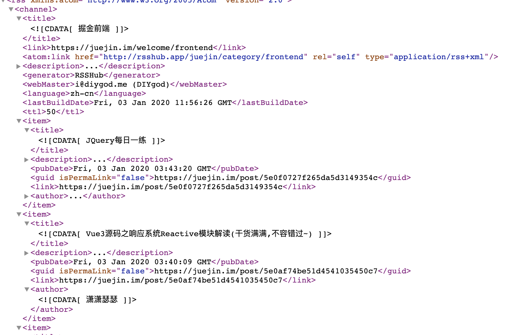

## RSS
以前只是听说过 rss 订阅，但是从来没有自己玩过。
最近，在周一早上看博客的时候，书签来回切换很是麻烦，忽然又想到了 rss，于是手机装了一个 reeder，开始倒腾起了 rss，感觉真的很好用，就是文章太多。。。，有点看不过来了。。。，写一篇文章和大家分享下 rss (水一篇，，，)

### 什么是 rss
RSS（简易信息聚合）是一种消息来源格式规范，用以聚合经常发布更新数据的网站，例如博客文章、新闻、音频或视频的网摘。RSS文件（或称做摘要、网络摘要、或频更新，提供到频道）包含全文或是节录的文字，再加上发布者所订阅之网摘数据和授权的元数据。

> 上面截取自维基百科中文版，说人话就是 rss 就是按照约定的格式对网站的一个消息聚合，通常是集中一些重要的信息，格式就是 xml

### rss 好处
上面说到 rss 就是对网站信息的一个聚合，rss 能够给我们带来很大的便利

* 订阅 rss，使用 rss 阅读器，可以免去了广告的打扰，只看自己想要的信息
* 避免了很多页面的来回切换，每周一早上都要切换十几个页面。。
* 信息集中化，避免碎片化

### rss 规范
说到 rss 的规范，其实主要有两个一个是 rss 规范，一个是 atom 规范，因为 rss 规范版权归哈佛大学所有，并且冻结了 (到 2.0)， 但是 Atompub 工作组（属于 IETF）就 Atom 1.0 规范达成一致意见，并在将来有可能重新修订。

主要的差别如下:

* atom 可以通过标签识别一个内容是否是全文输出而RSS2.0不可以
* atom 不仅能够判断出内容是否是全文输出，在终端软件使用该摘要 (feed) 时，还可以从中得到哪一部分是"摘要"哪一部分是"全文"方便进行区别显示。

> 详细差别可以看这里 http://www.intertwingly.net/wiki/pie/Rss20AndAtom10Compared

> 规范地址 http://www.rssboard.org/rss-specification https://www.ietf.org/rfc/rfc4287.txt

### rss 原理
每个摘要文件实际上代表一个通道。它包含通道标题、链接、描述、作者等等。通道信息提供关于摘要的基本信息。通道信息之后是一些项。每项代表一篇可以从摘要阅读器阅读的真实的新闻或者文章。通常情况下，每项包含有标题、链接、更新时间和摘要信息。

`其实 rss 本质上就是按照约定的 xml 格式，把 feed 放到 xml 文件中，并且定期上传到 feed 对应的文件夹，然后 rss 软件就会到对应的网址拉取 xml 文件，然后按照约定的规范解析 xml 文件，展示对应 feed 的内容`

图片中的就是掘金的 rss 返回数据，可以看到

* 最开始的部分是 rss 相关的信息，包括版本、规范等
* 后面的 chanel 是正式的信息
  * title: rss 标题
  * link: 链接地址
  * link\:atom \: rss 地址
  * 等等
* 每一个 item 标签就是对应的一条数据(文章)，里面包含了 标题、信息、发布时间、作者、链接等信息

### rss 阅读器
https://zhuanlan.zhihu.com/p/45120897

> 目前我主要是用 reeder3 (ios、mac)

### 推荐的 rss
https://docs.rsshub.app/

### 后记
目前，也在刚刚使用阶段，整体体验不错，后面也会积累更好的 rss，分享出来～
